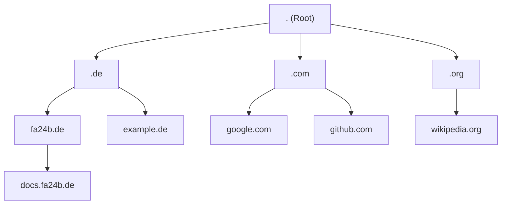
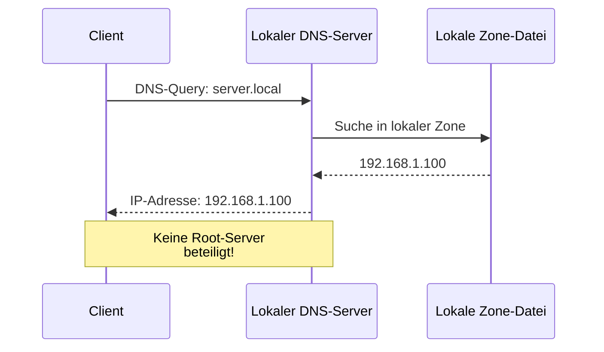
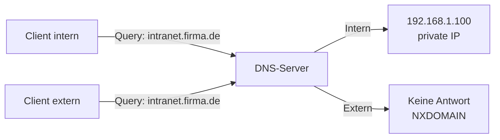
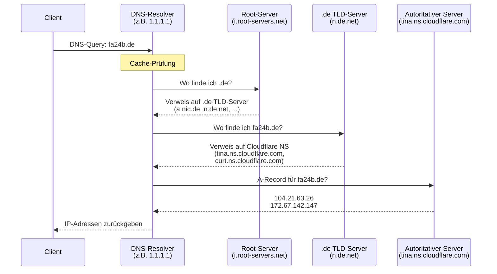

# DNS

## Was ist DNS und warum brauchen wir es?

Das **Domain Name System (DNS)** funktioniert wie ein Telefonbuch für Netzwerke. Seine Hauptfunktion ist die Umwandlung
von menschenlesbaren Domainnamen (wie [docs.fa24b.de](https://docs.fa24b.de)) in maschinenlesbare
IP-Adressen (wie 185.199.108.153). So können Webbrowser, E-Mail-Clients und andere Netzwerkdienste die
richtigen Server erreichen – sowohl im Internet als auch in lokalen Netzwerken.

### Warum ist DNS notwendig?

Computer kommunizieren über IP-Adressen miteinander. Für Menschen sind diese Zahlenfolgen jedoch schwer zu merken und unpraktisch.
Ohne DNS wäre es erforderlich, sich für jede Website die entsprechende IP-Adresse zu merken:

- **Mit DNS**: Es wird `www.google.com` eingegeben
- **Ohne DNS**: Es müsste `142.250.185.46` eingegeben werden

DNS löst dieses Problem, indem es als Vermittler zwischen Menschen und Maschinen fungiert.

### Die Hauptaufgaben des DNS

1. **Namensauflösung**: Übersetzung von Domainnamen in IP-Adressen (Forward Lookup)
2. **Reverse Lookup**: Übersetzung von IP-Adressen zurück in Domainnamen
3. **Lastverteilung**: Verteilung von Anfragen auf mehrere Server
4. **Redundanz**: Bereitstellung von Ausfallsicherheit durch mehrere DNS-Server
5. **E-Mail-Routing**: Bestimmung zuständiger Mailserver über MX-Records

### Beispiel einer DNS-Anfrage

Bei der Eingabe von `docs.fa24b.de` in einem Browser läuft folgender Prozess ab:

1. Der Browser fragt den lokalen DNS-Resolver nach der IP-Adresse
2. Falls nicht im Cache vorhanden, werden verschiedene DNS-Server abgefragt
3. Die IP-Adresse `185.199.108.153` wird zurückgeliefert
4. Der Browser kann nun eine Verbindung zum Webserver herstellen

Dieser gesamte Prozess dauert nur wenige Millisekunden und läuft vollautomatisch im Hintergrund ab.

## Aufbau und Hierarchie des DNS

Das DNS ist hierarchisch strukturiert, ähnlich einem umgekehrten Baum. Die Hierarchie besteht aus mehreren Ebenen, wobei jede Ebene für einen Teil des Domainnamens verantwortlich ist. Diese Struktur ermöglicht eine
skalierbare, ausfallsichere und dezentrale Verwaltung von Domainnamen.

### Die DNS-Hierarchieebenen



### Aufbau einer Domain

Eine Domain wie `docs.fa24b.de` wird von **rechts nach links** gelesen und besteht aus mehreren Ebenen:

```
docs  .  fa24b  .  de  .
 │        │        │   │
 │        │        │   └─── Root-Ebene (meist unsichtbar)
 │        │        └─────── Top-Level-Domain (TLD)
 │        └──────────────── Second-Level-Domain
 └───────────────────────── Subdomain
```

**Die vier Ebenen im Detail:**

1. **Root-Ebene (.)**: Die oberste Ebene, verwaltet von 13 Root-Server-Systemen
2. **Top-Level-Domain (TLD)**: Länder- oder themenbezogene Endungen (`.de`, `.com`, `.org`)
3. **Second-Level-Domain**: Der registrierte Domainname (z.B. `fa24b`)
4. **Subdomain**: Optionale Unterteilungen unterhalb der Domain (z.B. `docs`, `mail`)

Jede Ebene kann von unterschiedlichen Organisationen oder DNS-Registrars verwaltet werden, was eine dezentrale Verwaltung ermöglicht.

### Root-Ebene

An der Spitze der Hierarchie steht die Root-Zone:

- wird von 13 **Root-Server-Systemen** betrieben
- kennt keine einzelnen Hostnamen
- verweist ausschließlich auf die zuständigen Nameserver der TLDs (z.B. `.de`, `.com`, `.org`)

Die Root-Server bilden die Grundlage für die gesamte DNS-Infrastruktur und ermöglichen die Auflösung aller Domainnamen weltweit.

### Top-Level-Domains (TLDs)

Unterhalb der Root-Zone befinden sich die Top-Level-Domains:

- **Generische TLDs (gTLDs)**: z.B. `.com`, `.org`, `.net`
- **Länderspezifische TLDs (ccTLDs)**: z.B. `.de`, `.fr`, `.ch`

Die TLD-Server kennen die autoritativen Nameserver für die darunterliegenden Domains:

- Anfrage nach `fa24b.de` → Verweis auf `tina.ns.cloudflare.com` und `curt.ns.cloudflare.com`

### Second-Level-Domains

Die **Second-Level-Domain** ist der Teil direkt unterhalb der TLD:

- `fa24b` in `fa24b.de`

In diesem Bereich verwalten typischerweise Firmen, Organisationen oder Provider ihren eigenen DNS-Namensraum.

### Subdomains und Delegation

Unterhalb der Second-Level-Domain können beliebig viele **Subdomains** angelegt werden:

- `docs.fa24b.de` - Webserver mit Dokumentation
- `mail.fa24b.de` - Mailserver
- `intranet.fa24b.de` - internes Portal

**Verschachtelte Subdomains**: Subdomains können beliebig tief verschachtelt werden, sodass mehrere Ebenen möglich sind:

- `api.docs.fa24b.de` - API-Dokumentation (Subdomain der Subdomain)
- `dev.api.docs.fa24b.de` - Entwicklungs-API (drei Ebenen tief)
- `server1.datacenter.berlin.firma.de` - Mehrstufige Hierarchie für Organisation

Es gibt keine technische Begrenzung der Tiefe, jedoch ist die Gesamtlänge eines vollständigen Domainnamens (FQDN) auf 253 Zeichen begrenzt, wobei jedes Label (Teil zwischen den Punkten) maximal 63 Zeichen lang sein darf.

**Delegation**: Subdomains können wiederum zu **eigenen Zonen** mit eigenen autoritativen Nameservern werden. Dies nennt man **Delegation**. So lässt sich die Verwaltung auf verschiedene Abteilungen oder Standorte aufteilen.

### Zonen und Verantwortlichkeiten

Wichtiger Begriff im DNS ist die **Zone**:

- eine Zone ist der Teil der DNS-Hierarchie, der von einem Satz autoritativer Nameserver verwaltet wird
- eine Domain kann mehrere Zonen enthalten, wenn Teilbereiche delegiert werden

Beispiel:

- `schule.de` wird zentral vom Schulträger verwaltet
- `it.schule.de` wird an die IT-Abteilung delegiert und von deren eigenen Nameservern verwaltet

Dadurch entsteht eine **dezentrale**, aber logisch klar strukturierte Verwaltung des Namensraums.

### Die 13 Root-Server-Systeme

Es gibt weltweit [13 Root-Server-Systeme](https://root-servers.org/), die durch Buchstaben von A bis M identifiziert werden. Diese Server bilden die Grundlage des globalen DNS-Systems:

| Bezeichnung | Hostname | IPv4 | IPv6 | Betreiber |
|-------------|----------|------|------|-----------|
| **A** | a.root-servers.net | 198.41.0.4 | 2001:503:ba3e::2:30 | Verisign, Inc. |
| **B** | b.root-servers.net | 170.247.170.2 | 2801:1b8:10::b | USC-ISI |
| **C** | c.root-servers.net | 192.33.4.12 | 2001:500:2::c | Cogent Communications |
| **D** | d.root-servers.net | 199.7.91.13 | 2001:500:2d::d | University of Maryland |
| **E** | e.root-servers.net | 192.203.230.10 | 2001:500:a8::e | NASA |
| **F** | f.root-servers.net | 192.5.5.241 | 2001:500:2f::f | Internet Systems Consortium |
| **G** | g.root-servers.net | 192.112.36.4 | 2001:500:12::d0d | US DoD Network Information Center |
| **H** | h.root-servers.net | 198.97.190.53 | 2001:500:1::53 | US Army Research Lab |
| **I** | i.root-servers.net | 192.36.148.17 | 2001:7fe::53 | Netnod (Schweden) |
| **J** | j.root-servers.net | 192.58.128.30 | 2001:503:c27::2:30 | Verisign, Inc. |
| **K** | k.root-servers.net | 193.0.14.129 | 2001:7fd::1 | RIPE NCC (Europa) |
| **L** | l.root-servers.net | 199.7.83.42 | 2001:500:9f::42 | ICANN |
| **M** | m.root-servers.net | 202.12.27.33 | 2001:dc3::35 | WIDE Project (Japan) |

**Wichtig**: Jedes dieser 13 Root-Server-Systeme wird durch **Anycast** auf hunderte von physischen Servern weltweit verteilt. Dadurch gibt es tatsächlich über 1.000 physische Root-Server-Instanzen.

**Weiterführende Informationen:**

- [IANA Root Servers](https://www.iana.org/domains/root/servers) - Offizielle Liste der Root-Server
- [Root Server Technical Operations](https://root-servers.org/) - Technische Details und Statistiken
- [DNS Root Zone](https://www.internic.net/domain/root.zone) - Aktuelle Root-Zone-Datei
- [Verisign Root Server Map](https://www.verisign.com/en_US/innovation/dnssec/root-server-map/index.xhtml) - Geografische Verteilung

### DNS-Auflösung im lokalen Netzwerk

Die DNS-Auflösung muss nicht immer über die Root-Server erfolgen. In lokalen Netzwerken gibt es alternative Wege:

#### 1. Lokaler DNS-Server (ohne Root-Server)

In Unternehmensnetzwerken oder Heimnetzwerken kann ein lokaler DNS-Server interne Domainnamen auflösen, ohne jemals Root-Server zu kontaktieren:



**Beispiel**: In einem Unternehmensnetzwerk kann `server.local` oder `intranet.firma.de` direkt vom lokalen DNS-Server aufgelöst werden.

#### 2. Hosts-Datei

Noch vor der DNS-Abfrage prüft jedes Betriebssystem die lokale Hosts-Datei:

- **Linux/macOS**: `/etc/hosts`
- **Windows**: `C:\Windows\System32\drivers\etc\hosts`

```
# /etc/hosts
127.0.0.1       localhost
192.168.1.10    server.local
192.168.1.20    nas.local
```

#### 3. Split-DNS / Split-Horizon DNS

Bei Split-DNS liefert ein DNS-Server unterschiedliche Antworten, abhängig davon, ob die Anfrage aus dem internen oder externen Netzwerk kommt:



#### 4. mDNS (Multicast DNS)

Für lokale Netzwerke ohne DNS-Server existiert **mDNS** (verwendet von Apple Bonjour, Avahi):

- Auflösung von `.local` Domainnamen
- Broadcast-basiert im lokalen Netzwerk
- Beispiel: `rechner.local` wird automatisch gefunden

## DNS-Server-Typen und ihre Aufgaben

## Der DNS-Auflösungsprozess

Der DNS-Auflösungsprozess durchläuft mehrere Stufen, um einen Domainnamen in eine IP-Adresse aufzulösen. Dieser Prozess wird als **rekursive DNS-Abfrage** bezeichnet und folgt der hierarchischen Struktur des Domain Name Systems.

### Ablauf einer DNS-Auflösung



### Detaillierter Ablauf am Beispiel von fa24b.de

Die folgende Abfrage zeigt den tatsächlichen Auflösungsprozess für `fa24b.de`:

1. **Start beim Root-Server**
   - Der DNS-Resolver (z.B. 1.1.1.1 von Cloudflare) beginnt bei einem der 13 Root-Server
   - Root-Server: `a.root-servers.net` bis `m.root-servers.net`
   - Antwort: Verweis auf die `.de` TLD-Server

2. **Anfrage beim TLD-Server (.de)**
   - Kontaktierter Server: `n.de.net` (194.146.107.6)
   - Weitere .de TLD-Server: `a.nic.de`, `f.nic.de`, `z.nic.de`, `l.de.net`, `s.de.net`
   - Antwort: Verweis auf die autoritativen Nameserver von fa24b.de

3. **Anfrage beim autoritativen Nameserver**
   - Kontaktierter Server: `tina.ns.cloudflare.com` (172.64.32.230)
   - Alternativer Server: `curt.ns.cloudflare.com`
   - Antwort: Die tatsächlichen IP-Adressen
     ```
     fa24b.de.    300    IN    A    104.21.63.26
     fa24b.de.    300    IN    A    172.67.142.147
     ```

4. **Rückgabe an den Client**
   - Der Resolver gibt die IP-Adressen an den Client zurück
   - Die Antwort wird für 300 Sekunden (TTL) gecacht

### Rekursive vs. Iterative Abfrage

- **Rekursive Abfrage**: Der DNS-Resolver übernimmt die gesamte Arbeit und liefert die finale Antwort
- **Iterative Abfrage**: Der Resolver erhält Verweise und muss jeden Server selbst kontaktieren

Der oben gezeigte Prozess ist eine rekursive Abfrage vom Client zum Resolver, kombiniert mit iterativen Abfragen zwischen Resolver und den DNS-Servern.

## DNS-Record-Typen (Resource Records)

DNS-Records (auch Resource Records genannt) sind Datensätze in der DNS-Datenbank, die verschiedene Informationen über eine Domain enthalten. Jeder Record-Typ erfüllt eine spezifische Aufgabe.

### A-Record (Address Record)

**Funktion**: Ordnet einem Domainnamen eine IPv4-Adresse zu.

**Verwendung**: Dies ist der wichtigste und am häufigsten verwendete Record-Typ für Webseiten und Dienste.

**Beispiel**:
```
docs.fa24b.de.    3600    IN    A    185.199.108.153
docs.fa24b.de.    3600    IN    A    185.199.109.153
docs.fa24b.de.    3600    IN    A    185.199.110.153
docs.fa24b.de.    3600    IN    A    185.199.111.153
```

**Praxisbeispiel**: Die Domain `docs.fa24b.de` verfügt über mehrere A-Records, die auf verschiedene GitHub Pages Server zeigen. Dies ermöglicht Lastverteilung und erhöht die Verfügbarkeit der Website.

### AAAA-Record (IPv6 Address Record)

**Funktion**: Ordnet einem Domainnamen eine IPv6-Adresse zu.

**Verwendung**: Funktioniert wie A-Records, jedoch für IPv6-Netzwerke.

**Beispiel**:
```
docs.fa24b.de.    3600    IN    AAAA    2606:50c0:8000::153
docs.fa24b.de.    3600    IN    AAAA    2606:50c0:8001::153
docs.fa24b.de.    3600    IN    AAAA    2606:50c0:8002::153
docs.fa24b.de.    3600    IN    AAAA    2606:50c0:8003::153
```

**Praxisbeispiel**: Die Domain `docs.fa24b.de` verfügt über mehrere AAAA-Records für IPv6-Konnektivität. Moderne Geräte und Netzwerke nutzen zunehmend IPv6, und diese Records stellen sicher, dass die Website auch über IPv6 erreichbar ist.

### CNAME-Record (Canonical Name)

**Funktion**: Erstellt einen Alias für einen anderen Domainnamen (Weiterleitung auf einen anderen Namen).

**Verwendung**: Wenn mehrere Namen auf dasselbe Ziel zeigen sollen.

**Beispiel 1 - Website-Hosting**:
```
docs.fa24b.de.    300    IN    CNAME    wimwenigerkind.github.io.
```

**Beispiel 2 - DKIM E-Mail-Signierung**:
```
selector1._domainkey.fa24b.de.    3600    IN    CNAME    selector1-fa24b-de._domainkey.wimdevgroup.w-v1.dkim.mail.microsoft.
selector2._domainkey.fa24b.de.    3600    IN    CNAME    selector2-fa24b-de._domainkey.wimdevgroup.w-v1.dkim.mail.microsoft.
```

**Praxisbeispiel 1**: Die Domain `docs.fa24b.de` ist ein CNAME-Record, der auf `wimwenigerkind.github.io` zeigt. Wenn eine Anfrage für `docs.fa24b.de` eingeht, wird sie zu `wimwenigerkind.github.io` aufgelöst, welches dann zu den tatsächlichen GitHub Pages IP-Adressen aufgelöst wird. Dies ermöglicht eine flexible Verwaltung, da nur die IP-Adressen von `wimwenigerkind.github.io` aktualisiert werden müssen, ohne den CNAME zu ändern.

**Praxisbeispiel 2**: Die DKIM-Selektoren für `fa24b.de` werden über CNAME-Records auf die Microsoft-DKIM-Infrastruktur delegiert. Dies ermöglicht Microsoft, die DKIM-Schlüssel zentral zu verwalten und zu rotieren, ohne dass Änderungen in der Domain-Konfiguration erforderlich sind.

**Wichtig**: Ein CNAME-Record kann nicht zusammen mit anderen Records für denselben Namen existieren.

### MX-Record (Mail Exchange)

**Funktion**: Gibt an, welcher Mailserver für den E-Mail-Empfang einer Domain zuständig ist.

**Verwendung**: Für E-Mail-Routing und -Zustellung.

**Beispiel**:
```
fa24b.de.    3600    IN    MX    0    fa24b-de.mail.protection.outlook.com.
```

**Praxisbeispiel**: E-Mails an `user@fa24b.de` werden an den Microsoft Exchange Online Protection Server `fa24b-de.mail.protection.outlook.com` zugestellt. Die Priorität 0 ist die höchste Priorität. Bei mehreren MX-Records würde der Server mit der niedrigsten Prioritätszahl bevorzugt.

Die Zahl vor dem Servernamen gibt die Priorität an (niedriger = höher priorisiert).

### TXT-Record (Text Record)

**Funktion**: Speichert beliebige Textinformationen zu einer Domain.

**Verwendung**: Für verschiedene Zwecke wie SPF, DKIM, Domain-Verifizierung, etc.

**Beispiele**:

**SPF (Sender Policy Framework)** - Verhindert E-Mail-Spoofing:
```
fa24b.de.    3600    IN    TXT    "v=spf1 include:spf.protection.outlook.com ~all"
```

**Domain-Verifizierung** - Nachweis der Domain-Inhaberschaft (Microsoft):
```
fa24b.de.    3600    IN    TXT    "MS=ms37803661"
```

**DKIM** - E-Mail-Authentifizierung:
```
default._domainkey.fa24b.de.    IN    TXT    "v=DKIM1; k=rsa; p=MIGfMA0..."
```

**Praxisbeispiel**: Die Domain `fa24b.de` nutzt Microsoft Exchange Online Protection. Der SPF-Record `v=spf1 include:spf.protection.outlook.com ~all` erlaubt den Microsoft-Servern, E-Mails im Namen der Domain zu versenden. Der Microsoft-Verifizierungsrecord `MS=ms37803661` bestätigt die Domain-Inhaberschaft. Die DKIM-Signierung erfolgt über CNAME-Delegation an die Microsoft-Infrastruktur (siehe CNAME-Record-Beispiele).

### NS-Record (Name Server)

**Funktion**: Gibt an, welche DNS-Server für eine Domain oder Subdomain zuständig sind.

**Verwendung**: Delegation der DNS-Verantwortung an bestimmte Nameserver.

**Beispiel**:
```
fa24b.de.    86400    IN    NS    tina.ns.cloudflare.com.
fa24b.de.    86400    IN    NS    curt.ns.cloudflare.com.
```

**Praxisbeispiel**: Die Domain `fa24b.de` wird von den Cloudflare-Nameservern `tina.ns.cloudflare.com` und `curt.ns.cloudflare.com` verwaltet. Diese sind für die Auflösung aller DNS-Anfragen der Domain verantwortlich.

### PTR-Record (Pointer Record)

**Funktion**: Reverse DNS-Lookup - ordnet einer IP-Adresse einen Domainnamen zu (umgekehrte Richtung).

**Verwendung**: Hauptsächlich für E-Mail-Server und Netzwerk-Troubleshooting.

**Beispiel**:
```
153.108.199.185.in-addr.arpa.    3600    IN    PTR    cdn-185-199-108-153.github.com.
```

**Praxisbeispiel**: Der PTR-Record für die IP-Adresse `185.199.108.153` zeigt auf `cdn-185-199-108-153.github.com`. E-Mail-Server prüfen häufig PTR-Records, um die Legitimität der sendenden IP-Adresse zu verifizieren und Spam zu reduzieren.

### SOA-Record (Start of Authority)

**Funktion**: Enthält administrative Informationen über die DNS-Zone.

**Verwendung**: Definiert den primären Nameserver und verschiedene Timing-Parameter für die Zone.

**Beispiel**:
```
fa24b.de.    1800    IN    SOA    curt.ns.cloudflare.com. dns.cloudflare.com. (
                                   2390319800  ; Serial (Versionsnummer)
                                   10000       ; Refresh (ca. 2,7 Stunden)
                                   2400        ; Retry (40 Minuten)
                                   604800      ; Expire (7 Tage)
                                   1800 )      ; Minimum TTL (30 Minuten)
```

**Praxisbeispiel**: Der SOA-Record für `fa24b.de` definiert `curt.ns.cloudflare.com` als primären Nameserver mit `dns.cloudflare.com` als Kontakt-E-Mail. Die Serial-Nummer wird bei jeder Änderung erhöht, um sekundären DNS-Servern zu signalisieren, dass Updates verfügbar sind.

### SRV-Record (Service Record)

**Funktion**: Gibt Informationen über verfügbare Dienste an (Server, Port, Priorität, Gewichtung).

**Verwendung**: Für spezielle Dienste wie VoIP, Instant Messaging, LDAP, etc.

**Beispiel**:
```
_sip._tcp.fa24b.de.    3600    IN    SRV    10    60    5060    sipserver.fa24b.de.
```

Format: `Priorität Gewichtung Port Zielserver`

**Praxisbeispiel**: Microsoft Teams oder Skype for Business nutzen SRV-Records, um automatisch die richtigen Server und Ports für die Kommunikation zu finden.

### CAA-Record (Certification Authority Authorization)

**Funktion**: Gibt an, welche Zertifizierungsstellen (CAs) SSL/TLS-Zertifikate für die Domain ausstellen dürfen.

**Verwendung**: Erhöhte Sicherheit durch Kontrolle der Zertifikatsausstellung.

**Beispiel**:
```
fa24b.de.    3600    IN    CAA    0    issue    "letsencrypt.org"
fa24b.de.    3600    IN    CAA    0    issuewild "letsencrypt.org"
fa24b.de.    3600    IN    CAA    0    iodef    "mailto:security@fa24b.de"
```

**Praxisbeispiel**: Ausschließlich Let's Encrypt ist berechtigt, Zertifikate für `fa24b.de` auszustellen. Bei unautorisierten Ausstellungsversuchen erfolgt eine Benachrichtigung per E-Mail an `security@fa24b.de`.

### Zusammenfassung der wichtigsten Record-Typen

| Record-Typ | Hauptverwendung | Beispiel-Szenario |
|------------|-----------------|-------------------|
| **A** | IPv4-Adresse | Website erreichbar machen |
| **AAAA** | IPv6-Adresse | Website über IPv6 erreichbar machen |
| **CNAME** | Alias/Weiterleitung | `www` auf Hauptdomain umleiten |
| **MX** | E-Mail-Routing | E-Mails empfangen |
| **TXT** | Textinformationen | SPF, Domain-Verifizierung |
| **NS** | Nameserver-Delegation | DNS-Server festlegen |
| **PTR** | Reverse DNS | E-Mail-Reputation |
| **SOA** | Zone-Verwaltung | DNS-Zone-Konfiguration |
| **SRV** | Dienst-Lokalisierung | VoIP, Chat-Dienste |
| **CAA** | Zertifikats-Kontrolle | SSL/TLS-Sicherheit |

## DNS-Caching und TTL (Time to Live)

## DNS-Sicherheit: Bedrohungen und Schutzmaßnahmen

## Praktische DNS-Tools und Befehle

## DNS in der Praxis: Konfiguration und Verwaltung

## Zusammenfassung und Ausblick