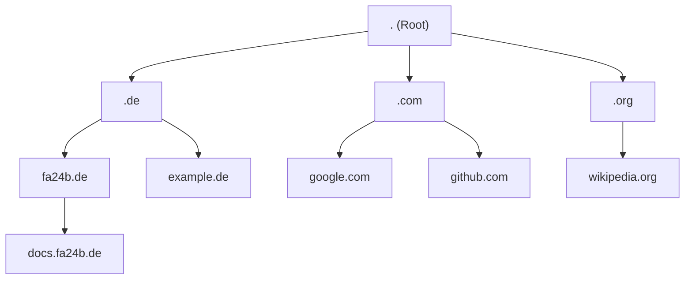
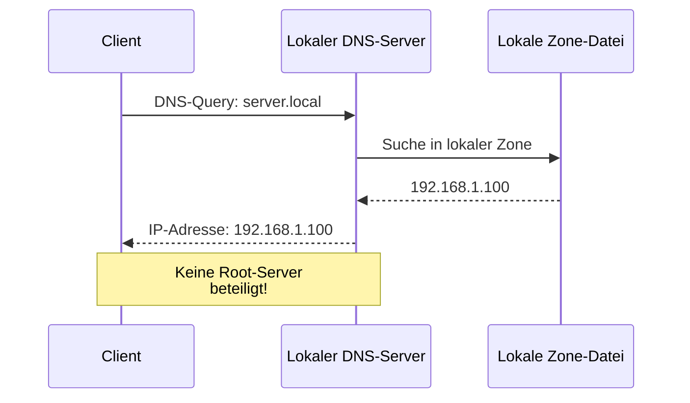
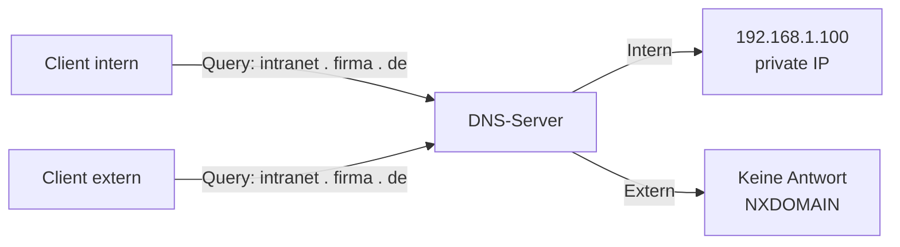
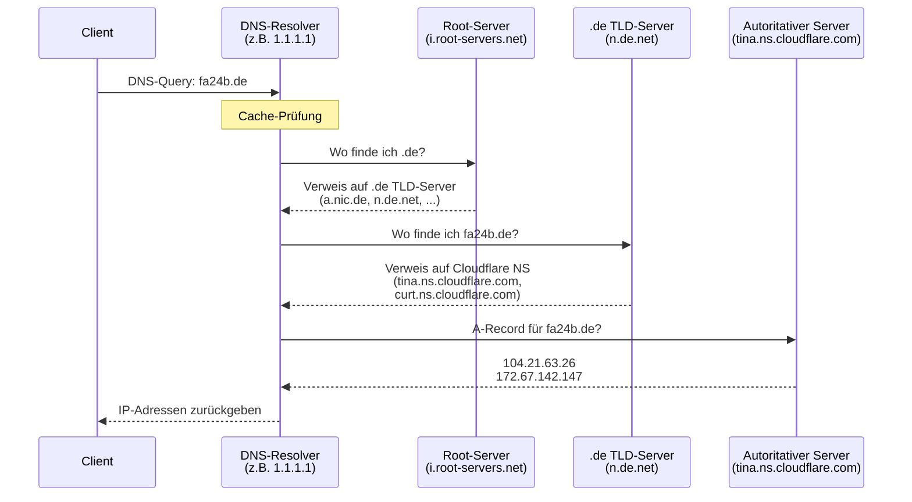
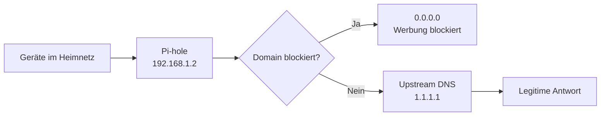
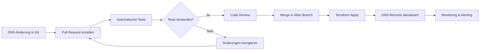

# DNS

## Was ist DNS und warum brauchen wir es?

Das **Domain Name System (DNS)** funktioniert wie ein Telefonbuch für Netzwerke. Seine Hauptfunktion ist die Umwandlung
von menschenlesbaren Domainnamen (wie [docs.fa24b.de](https://docs.fa24b.de)) in maschinenlesbare
IP-Adressen (wie 185.199.108.153). So können Webbrowser, E-Mail-Clients und andere Netzwerkdienste die
richtigen Server erreichen – sowohl im Internet als auch in lokalen Netzwerken.

### Warum ist DNS notwendig?

Computer kommunizieren über IP-Adressen miteinander. Für Menschen sind diese Zahlenfolgen jedoch schwer zu merken und
unpraktisch.
Ohne DNS wäre es erforderlich, sich für jede Website die entsprechende IP-Adresse zu merken:

- **Mit DNS**: Es wird `www.google.com` eingegeben
- **Ohne DNS**: Es müsste `142.250.185.46` eingegeben werden

DNS löst dieses Problem, indem es als Vermittler zwischen Menschen und Maschinen fungiert.

### Die Hauptaufgaben des DNS

1. **Namensauflösung**: Übersetzung von Domainnamen in IP-Adressen (Forward Lookup)
2. **Reverse Lookup**: Übersetzung von IP-Adressen zurück in Domainnamen
3. **Lastverteilung**: Verteilung von Anfragen auf mehrere Server
4. **Redundanz**: Bereitstellung von Ausfallsicherheit durch mehrere DNS-Server
5. **E-Mail-Routing**: Bestimmung zuständiger Mailserver über MX-Records

### Beispiel einer DNS-Anfrage

Bei der Eingabe von `docs.fa24b.de` in einem Browser läuft folgender Prozess ab:

1. Der Browser fragt den lokalen DNS-Resolver nach der IP-Adresse
2. Falls nicht im Cache vorhanden, werden verschiedene DNS-Server abgefragt
3. Die IP-Adresse `185.199.108.153` wird zurückgeliefert
4. Der Browser kann nun eine Verbindung zum Webserver herstellen

Dieser gesamte Prozess dauert nur wenige Millisekunden und läuft vollautomatisch im Hintergrund ab.

## Aufbau und Hierarchie des DNS

Das DNS ist hierarchisch strukturiert, ähnlich einem umgekehrten Baum. Die Hierarchie besteht aus mehreren Ebenen, wobei
jede Ebene für einen Teil des Domainnamens verantwortlich ist. Diese Struktur ermöglicht eine
skalierbare, ausfallsichere und dezentrale Verwaltung von Domainnamen.

### Die DNS-Hierarchieebenen



### Aufbau einer Domain

Eine Domain wie `docs.fa24b.de` wird von **rechts nach links** gelesen und besteht aus mehreren Ebenen:

```
docs  .  fa24b  .  de  .
 │        │        │   │
 │        │        │   └─── Root-Ebene (meist unsichtbar)
 │        │        └─────── Top-Level-Domain (TLD)
 │        └──────────────── Second-Level-Domain
 └───────────────────────── Subdomain
```

**Die vier Ebenen im Detail:**

1. **Root-Ebene (.)**: Die oberste Ebene, verwaltet von 13 Root-Server-Systemen
2. **Top-Level-Domain (TLD)**: Länder- oder themenbezogene Endungen (`.de`, `.com`, `.org`)
3. **Second-Level-Domain**: Der registrierte Domainname (z.B. `fa24b`)
4. **Subdomain**: Optionale Unterteilungen unterhalb der Domain (z.B. `docs`, `mail`)

Jede Ebene kann von unterschiedlichen Organisationen oder DNS-Registrars verwaltet werden, was eine dezentrale
Verwaltung ermöglicht.

### Root-Ebene

An der Spitze der Hierarchie steht die Root-Zone (`.`), die von 13 Root-Server-Systemen betrieben wird.

### Top-Level-Domains (TLDs)

Unterhalb der Root-Zone befinden sich die Top-Level-Domains wie `.com`, `.org`, `.net`, `.de`, `.fr` oder `.ch`.

### Second-Level-Domains

Die **Second-Level-Domain** ist der Teil direkt unterhalb der TLD:

- `fa24b` in `fa24b.de`

In diesem Bereich verwalten typischerweise Firmen, Organisationen oder Provider ihren eigenen DNS-Namensraum.

### Subdomains und Delegation

Unterhalb der Second-Level-Domain können beliebig viele **Subdomains** angelegt werden:

- `docs.fa24b.de` - Webserver mit Dokumentation
- `mail.fa24b.de` - Mailserver
- `intranet.fa24b.de` - internes Portal

**Verschachtelte Subdomains**: Subdomains können beliebig tief verschachtelt werden, sodass mehrere Ebenen möglich sind:

- `api.docs.fa24b.de` - API-Dokumentation (Subdomain der Subdomain)
- `dev.api.docs.fa24b.de` - Entwicklungs-API (drei Ebenen tief)
- `server1.datacenter.berlin.firma.de` - Mehrstufige Hierarchie für Organisation

Es gibt keine technische Begrenzung der Tiefe, jedoch ist die Gesamtlänge eines vollständigen Domainnamens (FQDN) auf
253 Zeichen begrenzt, wobei jedes Label (Teil zwischen den Punkten) maximal 63 Zeichen lang sein darf.

**Delegation**: Subdomains können wiederum zu **eigenen Zonen** mit eigenen autoritativen Nameservern werden. Dies nennt
man **Delegation**. So lässt sich die Verwaltung auf verschiedene Abteilungen oder Standorte aufteilen.

### Zonen und Verantwortlichkeiten

Wichtiger Begriff im DNS ist die **Zone**:

- eine Zone ist der Teil der DNS-Hierarchie, der von einem Satz autoritativer Nameserver verwaltet wird
- eine Domain kann mehrere Zonen enthalten, wenn Teilbereiche delegiert werden

Beispiel:

- `schule.de` wird zentral vom Schulträger verwaltet
- `it.schule.de` wird an die IT-Abteilung delegiert und von deren eigenen Nameservern verwaltet

Dadurch entsteht eine **dezentrale**, aber logisch klar strukturierte Verwaltung des Namensraums.

## DNS-Server-Typen und ihre Aufgaben

Im Domain Name System übernehmen unterschiedliche DNS-Server spezielle Aufgaben. Zusammengenommen sorgen sie dafür, dass
Domains wie `docs.fa24b.de` zuverlässig und schnell aufgelöst werden können.

### Rekursiver Resolver (DNS-Resolver)

Der **rekursive Resolver** ist meist der erste Ansprechpartner für Clients:

- läuft oft beim Internetprovider, in Unternehmen oder auf öffentlichen DNS-Diensten z.B. [1.1.1.1](https://1.1.1.1)(
  Cloudflare), [8.8.8.8](https://8.8.8.8)(Google)
- nimmt Anfragen von Clients entgegen (z.B. für `docs.fa24b.de`)
- fragt bei Bedarf weitere DNS-Server (Root, TLD, autoritative Server) ab
- speichert Antworten im **Cache**, um zukünftige Anfragen schneller zu beantworten

Der rekursive Resolver wird typischerweise im Router oder in den Netzwerkeinstellungen des Clients konfiguriert.

### Root-Server

Die **Root-Server** stehen an der Spitze der DNS-Hierarchie:

- kennen keine einzelnen Domains wie `fa24b.de`
- liefern nur Hinweise, welche **TLD-Server** für eine Endung wie `.de` zuständig sind
- sind weltweit verteilt und in 13 logische Servergruppen eingeteilt (`a.root-servers.net` bis `m.root-servers.net`)

Die Root-Server bilden die Grundlage für die gesamte DNS-Infrastruktur und ermöglichen die Auflösung aller Domainnamen
weltweit.

#### Die 13 Root-Server-Systeme

Es gibt weltweit [13 Root-Server-Systeme](https://root-servers.org/), die durch Buchstaben von A bis M identifiziert
werden:

| Bezeichnung | Hostname           | IPv4           | IPv6                | Betreiber                         |
|-------------|--------------------|----------------|---------------------|-----------------------------------|
| **A**       | a.root-servers.net | 198.41.0.4     | 2001:503:ba3e::2:30 | Verisign, Inc.                    |
| **B**       | b.root-servers.net | 170.247.170.2  | 2801:1b8:10::b      | USC-ISI                           |
| **C**       | c.root-servers.net | 192.33.4.12    | 2001:500:2::c       | Cogent Communications             |
| **D**       | d.root-servers.net | 199.7.91.13    | 2001:500:2d::d      | University of Maryland            |
| **E**       | e.root-servers.net | 192.203.230.10 | 2001:500:a8::e      | NASA                              |
| **F**       | f.root-servers.net | 192.5.5.241    | 2001:500:2f::f      | Internet Systems Consortium       |
| **G**       | g.root-servers.net | 192.112.36.4   | 2001:500:12::d0d    | US DoD Network Information Center |
| **H**       | h.root-servers.net | 198.97.190.53  | 2001:500:1::53      | US Army Research Lab              |
| **I**       | i.root-servers.net | 192.36.148.17  | 2001:7fe::53        | Netnod (Schweden)                 |
| **J**       | j.root-servers.net | 192.58.128.30  | 2001:503:c27::2:30  | Verisign, Inc.                    |
| **K**       | k.root-servers.net | 193.0.14.129   | 2001:7fd::1         | RIPE NCC (Europa)                 |
| **L**       | l.root-servers.net | 199.7.83.42    | 2001:500:9f::42     | ICANN                             |
| **M**       | m.root-servers.net | 202.12.27.33   | 2001:dc3::35        | WIDE Project (Japan)              |

**Wichtig**: Jedes dieser 13 Root-Server-Systeme wird durch **Anycast** auf hunderte von physischen Servern weltweit
verteilt. Dadurch gibt es tatsächlich über 1.000 physische Root-Server-Instanzen.

**Weiterführende Informationen:**

- [IANA Root Servers](https://www.iana.org/domains/root/servers) - Offizielle Liste der Root-Server
- [Root Server Technical Operations](https://root-servers.org/) - Technische Details und Statistiken
- [DNS Root Zone](https://www.internic.net/domain/root.zone) - Aktuelle Root-Zone-Datei
- [Verisign Root Server Map](https://www.verisign.com/en_US/innovation/dnssec/root-server-map/index.xhtml) -
  Geografische Verteilung

### TLD-Server (Top-Level-Domain-Server)

Die **TLD-Server** sind für eine bestimmte Domain-Endung zuständig, z.B. `.de`:

- verwalten Informationen darüber, welche **autoritativen Nameserver** für eine Domain wie `fa24b.de` zuständig sind
- speichern *keine* A-Records für `docs.fa24b.de`, sondern nur NS-Records für `fa24b.de`
- Beispiel: `.de`-Server wie `a.nic.de`, `n.de.net`, `z.nic.de`

Bei einer Anfrage nach `fa24b.de` liefern die `.de`-TLD-Server die zuständigen Cloudflare-Nameserver zurück.

**TLD-Kategorien:**

- **Generische TLDs (gTLDs)**: z.B. `.com`, `.org`, `.net`
- **Länderspezifische TLDs (ccTLDs)**: z.B. `.de`, `.fr`, `.ch`

### Autoritative Nameserver

**Autoritative Nameserver** liefern die „endgültige Wahrheit" für eine Zone:

- sind für eine bestimmte Domain oder Subdomain zuständig, z.B. `fa24b.de`
- enthalten die eigentlichen DNS-Einträge (A, AAAA, MX, TXT, CNAME, ...)
- Beispiel für `fa24b.de`:
    - `tina.ns.cloudflare.com`
    - `curt.ns.cloudflare.com`

Wenn der rekursive Resolver die autoritativen Nameserver von `fa24b.de` fragt, bekommt er z.B. die A-Records und CNAMEs,
die für `fa24b.de` und `docs.fa24b.de` konfiguriert sind.

### Caching-DNS-Server

Viele rekursive Resolver arbeiten gleichzeitig als **Caching-DNS-Server**:

- speichern Antworten für die Dauer der **TTL** (Time to Live)
- entlasten Root-, TLD- und autoritative Server
- sorgen dafür, dass häufig angefragte Domains wie `docs.fa24b.de` schneller beantwortet werden

Beispiel: Wenn viele Nutzer kurz hintereinander `docs.fa24b.de` aufrufen, kommt nach der ersten Auflösung die Antwort
für eine gewisse Zeit direkt aus dem Cache.

### Lokaler DNS-Server (z.B. im Unternehmen oder Heimnetz)

In Unternehmen oder komplexeren Heimnetzen gibt es oft eigene **lokale DNS-Server**:

- können interne Namen auflösen (z.B. `fileserver.fa24b.de`, `intranet.fa24b.de`)
- leiten externe Anfragen (z.B. `docs.fa24b.de`) an öffentliche rekursive Resolver weiter
- ermöglichen zentrale Verwaltung und Protokollierung von DNS-Anfragen

Im Heimnetz übernimmt diese Rolle häufig der Router, der Anfragen der Clients sammelt und an den Provider-DNS
weitergibt.

#### Lokale DNS-Auflösung ohne Root-Server

In lokalen Netzwerken kann die DNS-Auflösung auch ohne Kontakt zu Root-Servern erfolgen:

**1. Lokaler DNS-Server mit eigenen Zonen**

Ein lokaler DNS-Server kann interne Domainnamen direkt auflösen, ohne Root-Server zu kontaktieren:



**Beispiel**: In einem Unternehmensnetzwerk kann `server.local` oder `intranet.firma.de` direkt vom lokalen DNS-Server
aufgelöst werden.

**2. Hosts-Datei**

Noch vor der DNS-Abfrage prüft jedes Betriebssystem die lokale Hosts-Datei:

- **Linux/macOS**: `/etc/hosts`
- **Windows**: `C:\Windows\System32\drivers\etc\hosts`

```
# /etc/hosts
127.0.0.1       localhost
192.168.1.10    server.local
192.168.1.20    nas.local
```

**3. mDNS (Multicast DNS)**

Für lokale Netzwerke ohne DNS-Server existiert **mDNS** (verwendet von Apple Bonjour, Avahi):

- Auflösung von `.local` Domainnamen
- Broadcast-basiert im lokalen Netzwerk
- Beispiel: `rechner.local` wird automatisch gefunden
- Keine zentrale Serverinfrastruktur erforderlich

**4. Split-DNS / Split-Horizon DNS**

Bei Split-DNS liefert ein DNS-Server unterschiedliche Antworten, abhängig davon, ob die Anfrage aus dem internen oder
externen Netzwerk kommt:



### Zusammenspiel der Server-Typen

Bei einer Anfrage nach `docs.fa24b.de` arbeiten mehrere Servertypen zusammen:

1. Client fragt den **rekursiven Resolver** (z.B. beim Provider oder im Router)
2. Resolver fragt bei Bedarf **Root-Server** → erhält Verweis auf `.de`-TLD-Server
3. Resolver fragt **.de TLD-Server** → erhält Verweis auf die autoritativen Nameserver von `fa24b.de`
4. Resolver fragt **autoritativen Nameserver** von `fa24b.de` → erhält z.B. CNAME/A-Records für `docs.fa24b.de`
5. Resolver speichert die Antwort im **Cache** und gibt sie an den Client zurück

So wird die Last verteilt und die Auflösung bleibt trotz der verteilten Struktur performant und ausfallsicher.

## Der DNS-Auflösungsprozess

Der DNS-Auflösungsprozess durchläuft mehrere Stufen, um einen Domainnamen in eine IP-Adresse aufzulösen. Dieser Prozess
wird als **rekursive DNS-Abfrage** bezeichnet und folgt der hierarchischen Struktur des Domain Name Systems.

### Ablauf einer DNS-Auflösung



### Detaillierter Ablauf am Beispiel von fa24b.de

Die folgende Abfrage zeigt den tatsächlichen Auflösungsprozess für `fa24b.de`:

1. **Start beim Root-Server**
    - Der DNS-Resolver (z.B. 1.1.1.1 von Cloudflare) beginnt bei einem der 13 Root-Server
    - Root-Server: `a.root-servers.net` bis `m.root-servers.net`
    - Antwort: Verweis auf die `.de` TLD-Server

2. **Anfrage beim TLD-Server (.de)**
    - Kontaktierter Server: `n.de.net` (194.146.107.6)
    - Weitere .de TLD-Server: `a.nic.de`, `f.nic.de`, `z.nic.de`, `l.de.net`, `s.de.net`
    - Antwort: Verweis auf die autoritativen Nameserver von fa24b.de

3. **Anfrage beim autoritativen Nameserver**
    - Kontaktierter Server: `tina.ns.cloudflare.com` (172.64.32.230)
    - Alternativer Server: `curt.ns.cloudflare.com`
    - Antwort: Die tatsächlichen IP-Adressen
      ```
      fa24b.de.    300    IN    A    104.21.63.26
      fa24b.de.    300    IN    A    172.67.142.147
      ```

4. **Rückgabe an den Client**
    - Der Resolver gibt die IP-Adressen an den Client zurück
    - Die Antwort wird für 300 Sekunden (TTL) gecacht

### Rekursive vs. Iterative Abfrage

- **Rekursive Abfrage**: Der DNS-Resolver übernimmt die gesamte Arbeit und liefert die finale Antwort
- **Iterative Abfrage**: Der Resolver erhält Verweise und muss jeden Server selbst kontaktieren

Der oben gezeigte Prozess ist eine rekursive Abfrage vom Client zum Resolver, kombiniert mit iterativen Abfragen
zwischen Resolver und den DNS-Servern.

## DNS-Record-Typen (Resource Records)

DNS-Records (auch Resource Records genannt) sind Datensätze in der DNS-Datenbank, die verschiedene Informationen über
eine Domain enthalten. Jeder Record-Typ erfüllt eine spezifische Aufgabe.

### A-Record (Address Record)

**Funktion**: Ordnet einem Domainnamen eine IPv4-Adresse zu.

**Verwendung**: Dies ist der wichtigste und am häufigsten verwendete Record-Typ für Webseiten und Dienste.

**Beispiel**:

```
docs.fa24b.de.    3600    IN    A    185.199.108.153
docs.fa24b.de.    3600    IN    A    185.199.109.153
docs.fa24b.de.    3600    IN    A    185.199.110.153
docs.fa24b.de.    3600    IN    A    185.199.111.153
```

**Praxisbeispiel**: Die Domain `docs.fa24b.de` verfügt über mehrere A-Records, die auf verschiedene GitHub Pages Server
zeigen. Dies ermöglicht Lastverteilung und erhöht die Verfügbarkeit der Website.

### AAAA-Record (IPv6 Address Record)

**Funktion**: Ordnet einem Domainnamen eine IPv6-Adresse zu.

**Verwendung**: Funktioniert wie A-Records, jedoch für IPv6-Netzwerke.

**Beispiel**:

```
docs.fa24b.de.    3600    IN    AAAA    2606:50c0:8000::153
docs.fa24b.de.    3600    IN    AAAA    2606:50c0:8001::153
docs.fa24b.de.    3600    IN    AAAA    2606:50c0:8002::153
docs.fa24b.de.    3600    IN    AAAA    2606:50c0:8003::153
```

**Praxisbeispiel**: Die Domain `docs.fa24b.de` verfügt über mehrere AAAA-Records für IPv6-Konnektivität. Moderne Geräte
und Netzwerke nutzen zunehmend IPv6, und diese Records stellen sicher, dass die Website auch über IPv6 erreichbar ist.

### CNAME-Record (Canonical Name)

**Funktion**: Erstellt einen Alias für einen anderen Domainnamen (Weiterleitung auf einen anderen Namen).

**Verwendung**: Wenn mehrere Namen auf dasselbe Ziel zeigen sollen.

**Beispiel 1 - Website-Hosting**:

```
docs.fa24b.de.    300    IN    CNAME    wimwenigerkind.github.io.
```

**Beispiel 2 - DKIM E-Mail-Signierung**:

```
selector1._domainkey.fa24b.de.    3600    IN    CNAME    selector1-fa24b-de._domainkey.wimdevgroup.w-v1.dkim.mail.microsoft.
selector2._domainkey.fa24b.de.    3600    IN    CNAME    selector2-fa24b-de._domainkey.wimdevgroup.w-v1.dkim.mail.microsoft.
```

**Praxisbeispiel 1**: Die Domain `docs.fa24b.de` ist ein CNAME-Record, der auf `wimwenigerkind.github.io` zeigt. Wenn
eine Anfrage für `docs.fa24b.de` eingeht, wird sie zu `wimwenigerkind.github.io` aufgelöst, welches dann zu den
tatsächlichen GitHub Pages IP-Adressen aufgelöst wird. Dies ermöglicht eine flexible Verwaltung, da nur die IP-Adressen
von `wimwenigerkind.github.io` aktualisiert werden müssen, ohne den CNAME zu ändern.

**Praxisbeispiel 2**: Die DKIM-Selektoren für `fa24b.de` werden über CNAME-Records auf die Microsoft-DKIM-Infrastruktur
delegiert. Dies ermöglicht Microsoft, die DKIM-Schlüssel zentral zu verwalten und zu rotieren, ohne dass Änderungen in
der Domain-Konfiguration erforderlich sind.

**Wichtig**: Ein CNAME-Record kann nicht zusammen mit anderen Records für denselben Namen existieren.

### MX-Record (Mail Exchange)

**Funktion**: Gibt an, welcher Mailserver für den E-Mail-Empfang einer Domain zuständig ist.

**Verwendung**: Für E-Mail-Routing und -Zustellung.

**Beispiel**:

```
fa24b.de.    3600    IN    MX    0    fa24b-de.mail.protection.outlook.com.
```

**Praxisbeispiel**: E-Mails an `user@fa24b.de` werden an den Microsoft Exchange Online Protection Server
`fa24b-de.mail.protection.outlook.com` zugestellt. Die Priorität 0 ist die höchste Priorität. Bei mehreren MX-Records
würde der Server mit der niedrigsten Prioritätszahl bevorzugt.

Die Zahl vor dem Servernamen gibt die Priorität an (niedriger = höher priorisiert).

### TXT-Record (Text Record)

**Funktion**: Speichert beliebige Textinformationen zu einer Domain.

**Verwendung**: Für verschiedene Zwecke wie SPF, DKIM, Domain-Verifizierung, etc.

**Beispiele**:

**SPF (Sender Policy Framework)** - Verhindert E-Mail-Spoofing:

```
fa24b.de.    3600    IN    TXT    "v=spf1 include:spf.protection.outlook.com ~all"
```

**Domain-Verifizierung** - Nachweis der Domain-Inhaberschaft (Microsoft):

```
fa24b.de.    3600    IN    TXT    "MS=ms37803661"
```

**DKIM** - E-Mail-Authentifizierung:

```
default._domainkey.fa24b.de.    IN    TXT    "v=DKIM1; k=rsa; p=MIGfMA0..."
```

**Praxisbeispiel**: Die Domain `fa24b.de` nutzt Microsoft Exchange Online Protection. Der SPF-Record
`v=spf1 include:spf.protection.outlook.com ~all` erlaubt den Microsoft-Servern, E-Mails im Namen der Domain zu
versenden. Der Microsoft-Verifizierungsrecord `MS=ms37803661` bestätigt die Domain-Inhaberschaft. Die DKIM-Signierung
erfolgt über CNAME-Delegation an die Microsoft-Infrastruktur (siehe CNAME-Record-Beispiele).

### NS-Record (Name Server)

**Funktion**: Gibt an, welche DNS-Server für eine Domain oder Subdomain zuständig sind.

**Verwendung**: Delegation der DNS-Verantwortung an bestimmte Nameserver.

**Beispiel**:

```
fa24b.de.    86400    IN    NS    tina.ns.cloudflare.com.
fa24b.de.    86400    IN    NS    curt.ns.cloudflare.com.
```

**Praxisbeispiel**: Die Domain `fa24b.de` wird von den Cloudflare-Nameservern `tina.ns.cloudflare.com` und
`curt.ns.cloudflare.com` verwaltet. Diese sind für die Auflösung aller DNS-Anfragen der Domain verantwortlich.

### PTR-Record (Pointer Record)

**Funktion**: Reverse DNS-Lookup - ordnet einer IP-Adresse einen Domainnamen zu (umgekehrte Richtung).

**Verwendung**: Hauptsächlich für E-Mail-Server und Netzwerk-Troubleshooting.

**Beispiel**:

```
153.108.199.185.in-addr.arpa.    3600    IN    PTR    cdn-185-199-108-153.github.com.
```

**Praxisbeispiel**: Der PTR-Record für die IP-Adresse `185.199.108.153` zeigt auf `cdn-185-199-108-153.github.com`.
E-Mail-Server prüfen häufig PTR-Records, um die Legitimität der sendenden IP-Adresse zu verifizieren und Spam zu
reduzieren.

### SOA-Record (Start of Authority)

**Funktion**: Enthält administrative Informationen über die DNS-Zone.

**Verwendung**: Definiert den primären Nameserver und verschiedene Timing-Parameter für die Zone.

**Beispiel**:

```
fa24b.de.    1800    IN    SOA    curt.ns.cloudflare.com. dns.cloudflare.com. (
                                   2390319800  ; Serial (Versionsnummer)
                                   10000       ; Refresh (ca. 2,7 Stunden)
                                   2400        ; Retry (40 Minuten)
                                   604800      ; Expire (7 Tage)
                                   1800 )      ; Minimum TTL (30 Minuten)
```

**Praxisbeispiel**: Der SOA-Record für `fa24b.de` definiert `curt.ns.cloudflare.com` als primären Nameserver mit
`dns.cloudflare.com` als Kontakt-E-Mail. Die Serial-Nummer wird bei jeder Änderung erhöht, um sekundären DNS-Servern zu
signalisieren, dass Updates verfügbar sind.

### SRV-Record (Service Record)

**Funktion**: Gibt Informationen über verfügbare Dienste an (Server, Port, Priorität, Gewichtung).

**Verwendung**: Für spezielle Dienste wie VoIP, Instant Messaging, LDAP, etc.

**Beispiel**:

```
_sip._tcp.fa24b.de.    3600    IN    SRV    10    60    5060    sipserver.fa24b.de.
```

Format: `Priorität Gewichtung Port Zielserver`

**Praxisbeispiel**: Microsoft Teams oder Skype for Business nutzen SRV-Records, um automatisch die richtigen Server und
Ports für die Kommunikation zu finden.

### CAA-Record (Certification Authority Authorization)

**Funktion**: Gibt an, welche Zertifizierungsstellen (CAs) SSL/TLS-Zertifikate für die Domain ausstellen dürfen.

**Verwendung**: Erhöhte Sicherheit durch Kontrolle der Zertifikatsausstellung.

**Beispiel**:

```
fa24b.de.    3600    IN    CAA    0    issue    "letsencrypt.org"
fa24b.de.    3600    IN    CAA    0    issuewild "letsencrypt.org"
fa24b.de.    3600    IN    CAA    0    iodef    "mailto:security@fa24b.de"
```

**Praxisbeispiel**: Ausschließlich Let's Encrypt ist berechtigt, Zertifikate für `fa24b.de` auszustellen. Bei
unautorisierten Ausstellungsversuchen erfolgt eine Benachrichtigung per E-Mail an `security@fa24b.de`.

### Zusammenfassung der wichtigsten Record-Typen

| Record-Typ | Hauptverwendung       | Beispiel-Szenario                   |
|------------|-----------------------|-------------------------------------|
| **A**      | IPv4-Adresse          | Website erreichbar machen           |
| **AAAA**   | IPv6-Adresse          | Website über IPv6 erreichbar machen |
| **CNAME**  | Alias/Weiterleitung   | `www` auf Hauptdomain umleiten      |
| **MX**     | E-Mail-Routing        | E-Mails empfangen                   |
| **TXT**    | Textinformationen     | SPF, Domain-Verifizierung           |
| **NS**     | Nameserver-Delegation | DNS-Server festlegen                |
| **PTR**    | Reverse DNS           | E-Mail-Reputation                   |
| **SOA**    | Zone-Verwaltung       | DNS-Zone-Konfiguration              |
| **SRV**    | Dienst-Lokalisierung  | VoIP, Chat-Dienste                  |
| **CAA**    | Zertifikats-Kontrolle | SSL/TLS-Sicherheit                  |

## DNS-Caching und TTL (Time to Live)

DNS-Resolver speichern Antworten temporär im Cache, um die Auflösungsgeschwindigkeit zu erhöhen und die Last
auf Root-, TLD- und autoritativen Nameservern zu reduzieren. Die Lebensdauer einer gecachten Antwort wird durch die
TTL (Time to Live) in Sekunden bestimmt. Eine typische TTL-Angabe steht direkt in DNS-Records und wird von
rekursiven Resolvern beim Zwischenspeichern respektiert.

### Wichtige Konzepte

- **TTL (Beispiel)**: `docs.fa24b.de. 3600 IN A 185.199.108.153` → TTL = 3600s (1 Stunde).
- **Cache-Hierarchie**: Clients ↔️ lokaler Resolver ↔️ rekursiver Resolver ↔️ autoritativer Server. Jeder Caching-Layer
    hält Antworten unabhängig vor.
- **Negative Caching**: Auch Nicht-Antworten (z.B. `NXDOMAIN`) werden für eine Zeit zwischengespeichert (gemäß
    SOA/MinTTL-Angaben).

### Vor- und Nachteile verschiedener TTL-Werte

- **Lange TTLs (z. B. 86400s / 24h)**: weniger Abfragen, geringere Last, bessere Verfügbarkeit bei Ausfall von
    Nameservern. Nachteil: Änderungen (IP-Wechsel, Short-lived Failover) propagieren langsam.
- **Kurze TTLs (z. B. 60–300s)**: schnelle Propagation bei Änderungen, aber höhere Abfragezahl und erhöhte Last.

Praktische Empfehlung: Setze TTLs situativ. Für stabile Ressourcen längere TTLs, für Dienste mit häufigen
Änderungen kurze TTLs während der Umstellung und danach wieder erhöhen.

### Beispiel: TTL prüfen

Mit `dig` lässt sich die verbleibende TTL direkt sehen:

```bash
dig +noall +answer docs.fa24b.de A
; Ausgabe: docs.fa24b.de. 3600 IN A 185.199.108.153
```

Mit `dig +trace` lässt sich außerdem der komplette Auflösungsweg (inkl. TTL-Anzeigen) nachvollziehen.

## DNS-Sicherheit: Bedrohungen und Schutzmaßnahmen

DNS ist ein attraktives Ziel für Angriffe und Manipulationen. Häufige Bedrohungen sind **Cache Poisoning/DNS Spoofing**,
**DDoS-Angriffe auf Nameserver**, **Registrar-/WHOIS-Hijacking**, **DNS-Tunneling** (Datenexfiltration) und **Man-in-the-Middle**-Angriffe
auf unverschlüsselten DNS-Transporten.

### Schutzmaßnahmen (Kurzüberblick)

- **DNSSEC**: Signiert DNS-Antworten kryptographisch (RRSIG, DNSKEY). Schützt gegen Manipulation und Cache-Poisoning,
    indem die Integrität von Records geprüft wird. Wichtiger Hinweis: DNSSEC authentifiziert, verschlüsselt aber nicht.
- **Verschlüsselte DNS-Protokolle**: DoT (DNS over TLS) und DoH (DNS over HTTPS) schützen die Privatsphäre und
    Integrität der Transportverbindung gegen Mitlesen und Blockaden.
- **Harte Authentisierung für Registrar/Nameserver-Accounts**: 2FA, starke Passwörter und Zugangskontrollen
    verhindern Domain-Hijacking.
- **TSIG**: Absicherung von Zonentransfers zwischen Nameservern mittels Shared Secrets.
- **Rate Limiting & Anycast**: DDoS-Resilienz durch Anycast-Deployment und Anfragelimits auf Resolver/Autoren.
- **Monitoring & Logging**: Anomalien (plötzliche TTL-Änderungen, ungewöhnliche Antwortmuster) frühzeitig erkennen.
- **Minimale Angriffsfläche**: Nur notwendige Records publizieren, administrative Kontakte schützen, CAA für
    Zertifikats-Aussteller setzen.

### Kurze Praxis-Checks

- **DNSSEC prüfen**: `dig +dnssec example.com` → prüft Vorhandensein von RRSIG/DNSKEY.
- **CAA prüfen**: `dig example.com CAA +short` → zeigt, welche CAs zertifizieren dürfen.

Beispiel: DNSSEC-gestützte Abfrage mit `dig`:

```bash
dig +dnssec fa24b.de A
; RRSIG-Einträge in der Antwort zeigen, dass die Zone signiert ist
```

Hinweis: DNSSEC-Einführung erfordert Koordination mit Registrar/Hosting und korrekte Key-Rotation.

## Praktische DNS-Tools und Befehle

Für Troubleshooting und Audits sind folgende Tools essenziell. Die Beispiele zeigen typische Prüfaufgaben.

- **dig (Linux/macOS, auch Windows via BIND-utils)** – universelles DNS-Diagnosewerkzeug
    - A-Record: `dig +noall +answer docs.fa24b.de A`
    - Trace: `dig +trace docs.fa24b.de`
    - DNSSEC: `dig +dnssec docs.fa24b.de`

- **nslookup** – älteres, aber weit verbreitetes Tool
    - Interaktive Nutzung: `nslookup` → `server 8.8.8.8` → `set type=MX` → `fa24b.de`

- **host** – einfache Abfragen
    - `host -t A docs.fa24b.de`

- **PowerShell (Windows)** – `Resolve-DnsName`
    - Beispiel: `Resolve-DnsName docs.fa24b.de -Type A`

- **rndc / named-checkzone** – Werkzeuge für Administratoren von BIND-Servern (Zonenprüfung, Cache-Management)

- **tcpdump / Wireshark** – Netzwerk-Captures für tiefgehende Analyse von DNS-Paketen
    - Beispiel: `sudo tcpdump -n -s 0 -vvv port 53`

- **systemd-resolve / systemd-resolved** – Abfragen und Cache-Management auf modernen Linux-Clients

- **Online-Tools** – DNSViz, Zonemaster, intoDNS: grafische/automatisierte Checks (DNSSEC, Delegation, Konfiguration)

### Häufige Admin-Aufgaben (Kurzreferenz)

- **DNS-Cache leeren**:
    - Windows: `ipconfig /flushdns`
    - macOS (aktuelles): `sudo killall -HUP mDNSResponder`
    - systemd/Linux: `sudo systemd-resolve --flush-caches` oder `sudo rndc flush` (BIND)

- **Schnell prüfen, welche Nameserver eine Domain verwendet**:
    - `dig +short NS fa24b.de`

- **TTL und SOA-Info anzeigen**:
    - `dig +nocmd fa24b.de SOA +noall +answer`

Diese Tools erlauben sowohl schnelle Checks als auch tiefergehende Untersuchungen bei Incidents. Für Automatisierung
eignen sich Skripte, die wiederkehrende Prüfungen (DNSSEC-Status, TTL-Änderungen, MX/SOA-Checks) ausführen und
bei Auffälligkeiten Alarme erstellen.

## DNS in der Praxis: Konfiguration und Verwaltung

Die praktische Konfiguration und Verwaltung von DNS-Einträgen stellt eine zentrale Aufgabe in der Netzwerkadministration
dar. Dieser Abschnitt behandelt die wichtigsten Aspekte der DNS-Verwaltung anhand konkreter Beispiele.

### DNS-Provider und Nameserver-Delegation

Die Wahl des DNS-Providers und die korrekte Delegation der Nameserver bilden die Grundlage der DNS-Konfiguration.

#### Nameserver-Konfiguration

Für die Domain `fa24b.de` sind folgende autoritative Nameserver konfiguriert:

```
fa24b.de.    86400    IN    NS    tina.ns.cloudflare.com.
fa24b.de.    86400    IN    NS    curt.ns.cloudflare.com.
```

**Wichtige Aspekte der Nameserver-Delegation:**

- **Mindestens zwei Nameserver**: Redundanz durch mehrere NS-Records erhöht die Ausfallsicherheit
- **TTL-Wert**: 86400 Sekunden (24 Stunden) für NS-Records ist Standard, da Nameserver-Änderungen selten erfolgen
- **Geografische Verteilung**: Cloudflare nutzt Anycast-Routing für globale Verfügbarkeit
- **Registrar-Einstellungen**: NS-Records müssen sowohl beim DNS-Provider als auch beim Domain-Registrar konfiguriert
  werden

#### Provider-Wechsel durchführen

Bei einem Wechsel des DNS-Providers müssen folgende Schritte beachtet werden:

1. **Vorbereitung**: Alle bestehenden DNS-Records dokumentieren
2. **TTL-Reduzierung**: TTL-Werte der kritischen Records 24-48 Stunden vor dem Wechsel reduzieren (z.B. auf 300
   Sekunden)
3. **Records übertragen**: Alle DNS-Einträge beim neuen Provider anlegen und überprüfen
4. **Nameserver-Update**: NS-Records beim Registrar auf die neuen Nameserver ändern
5. **Propagation abwarten**: DNS-Propagation kann bis zu 48 Stunden dauern (abhängig von den ursprünglichen TTL-Werten)
6. **Monitoring**: DNS-Auflösung von verschiedenen Standorten aus überwachen
7. **TTL-Normalisierung**: Nach erfolgreicher Propagation TTL-Werte wieder erhöhen

### DNS-Records verwalten

Die Verwaltung von DNS-Records erfordert Verständnis für die verschiedenen Record-Typen und deren Zusammenspiel.

#### Domain-Konfiguration für Webhosting

Für das Hosting von `docs.fa24b.de` auf GitHub Pages wird folgende Konfiguration verwendet:

```
docs.fa24b.de.    300    IN    CNAME    wimwenigerkind.github.io.
```

GitHub Pages löst den CNAME dann zu mehreren A- und AAAA-Records auf:

```
wimwenigerkind.github.io.    3600    IN    A       185.199.108.153
wimwenigerkind.github.io.    3600    IN    A       185.199.109.153
wimwenigerkind.github.io.    3600    IN    A       185.199.110.153
wimwenigerkind.github.io.    3600    IN    A       185.199.111.153
wimwenigerkind.github.io.    3600    IN    AAAA    2606:50c0:8000::153
wimwenigerkind.github.io.    3600    IN    AAAA    2606:50c0:8001::153
wimwenigerkind.github.io.    3600    IN    AAAA    2606:50c0:8002::153
wimwenigerkind.github.io.    3600    IN    AAAA    2606:50c0:8003::153
```

**Vorteil dieser Konfiguration**:

- Flexibilität: GitHub kann IP-Adressen ändern, ohne dass der CNAME-Record angepasst werden muss
- Lastverteilung: Mehrere IP-Adressen ermöglichen Load Balancing
- IPv6-Unterstützung: Automatische Dual-Stack-Konfiguration

**Alternative Konfiguration (direkte A-Records)**:

Für die Root-Domain wird häufig eine direkte A-Record-Konfiguration benötigt:

```
fa24b.de.    300    IN    A    104.21.63.26
fa24b.de.    300    IN    A    172.67.142.147
```

**Wichtig**: CNAME-Records können nicht auf der Root-Domain (Apex) verwendet werden, da dies mit anderen Record-Typen (
MX, TXT, SOA) kollidieren würde.

### DNS-Zonen und Zone-Files

In professionellen Umgebungen werden DNS-Einträge häufig als Zone-Files verwaltet.

#### Aufbau eines Zone-Files

Ein vollständiges Zone-File für `fa24b.de` könnte folgendermaßen strukturiert sein:

```bind
$ORIGIN fa24b.de.
$TTL 3600

; SOA-Record
@    IN    SOA    curt.ns.cloudflare.com. dns.cloudflare.com. (
                  2390319800  ; Serial
                  10000       ; Refresh (2,7 Stunden)
                  2400        ; Retry (40 Minuten)
                  604800      ; Expire (7 Tage)
                  1800 )      ; Minimum TTL (30 Minuten)

; Nameserver-Records
@    IN    NS     tina.ns.cloudflare.com.
@    IN    NS     curt.ns.cloudflare.com.

; A-Records für Root-Domain
@    IN    A      104.21.63.26
@    IN    A      172.67.142.147

; AAAA-Records für IPv6
@    IN    AAAA   2606:4700:3030::6815:3f1a
@    IN    AAAA   2606:4700:3030::ac43:8e93

; CNAME-Records für Subdomains
docs       IN    CNAME    wimwenigerkind.github.io.
www        IN    CNAME    fa24b.de.

; MX-Record für E-Mail
@    IN    MX     0    fa24b-de.mail.protection.outlook.com.

; TXT-Records für E-Mail-Authentifizierung
@    IN    TXT    "v=spf1 include:spf.protection.outlook.com ~all"
@    IN    TXT    "MS=ms37803661"

; DKIM-Records (CNAME-Delegation)
selector1._domainkey    IN    CNAME    selector1-fa24b-de._domainkey.wimdevgroup.w-v1.dkim.mail.microsoft.
selector2._domainkey    IN    CNAME    selector2-fa24b-de._domainkey.wimdevgroup.w-v1.dkim.mail.microsoft.

; DMARC-Record
_dmarc    IN    TXT    "v=DMARC1; p=quarantine; rua=mailto:dmarc@fa24b.de"

; CAA-Records für Zertifikatskontrolle
@    IN    CAA    0    issue    "letsencrypt.org"
@    IN    CAA    0    issuewild "letsencrypt.org"
@    IN    CAA    0    iodef    "mailto:security@fa24b.de"
```

**Wichtige Syntax-Elemente:**

- `$ORIGIN`: Definiert die Basis-Domain
- `$TTL`: Standard-TTL für alle Records ohne explizite TTL-Angabe
- `@`: Platzhalter für die Origin-Domain (`fa24b.de.`)
- `;`: Kommentarzeichen
- Trailing Dot (`.`): Vollqualifizierter Domain-Name (FQDN)

#### Serial-Nummer verwalten

Die Serial-Nummer im SOA-Record ist kritisch für DNS-Replikation:

**Format-Konventionen:**

1. **YYYYMMDDNN** (empfohlen):
    - `2025120401` = 4. Dezember 2025, 1. Änderung des Tages
    - Vorteil: Lesbar und chronologisch sortierbar

2. **Unix Timestamp**:
    - `2390319800` (wie bei Cloudflare)
    - Vorteil: Automatische Eindeutigkeit

**Regel**: Die Serial-Nummer muss bei jeder Änderung erhöht werden, damit sekundäre DNS-Server Updates erkennen.

### Subdomain-Delegation

Subdomains können an andere Nameserver delegiert werden, um dezentrale Verwaltung zu ermöglichen.

#### Beispiel: IT-Abteilung delegieren

Angenommen, die IT-Abteilung soll `it.fa24b.de` eigenständig verwalten:

**Im Haupt-Zone-File von fa24b.de:**

```bind
; Delegation von it.fa24b.de an separate Nameserver
it    IN    NS    ns1.it-intern.fa24b.de.
it    IN    NS    ns2.it-intern.fa24b.de.

; Glue-Records (erforderlich, wenn NS innerhalb der Subdomain liegt)
ns1.it-intern.fa24b.de.    IN    A    192.168.10.10
ns2.it-intern.fa24b.de.    IN    A    192.168.10.11
```

**Im Zone-File von it.fa24b.de (auf den IT-Nameservern):**

```bind
$ORIGIN it.fa24b.de.
$TTL 3600

@    IN    SOA    ns1.it-intern.fa24b.de. admin.it.fa24b.de. (
                  2025120401
                  7200
                  3600
                  1209600
                  3600 )

@    IN    NS     ns1.it-intern.fa24b.de.
@    IN    NS     ns2.it-intern.fa24b.de.

; IT-spezifische Records
server1       IN    A      192.168.10.20
server2       IN    A      192.168.10.21
fileserver    IN    A      192.168.10.30
```

**Vorteile der Delegation:**

- Autonome Verwaltung durch IT-Abteilung
- Keine Änderungen am Haupt-Zone-File erforderlich
- Getrennte Verantwortlichkeiten

### DNS-Server-Software

Verschiedene DNS-Server-Softwarelösungen bieten unterschiedliche Features für verschiedene Anforderungen.

#### Professionelle DNS-Server

| Software     | Typ                    | Haupteinsatzgebiet              | Besonderheiten                                                   |
|--------------|------------------------|---------------------------------|------------------------------------------------------------------|
| **BIND**     | Autoritativ & Rekursiv | Unternehmensumgebungen, ISPs    | Am weitesten verbreitet, Zone-Files, sehr konfigurierbar         |
| **Unbound**  | Rekursiv               | Sicherheitsorientierte Resolver | DNSSEC-Validierung, Privacy-Features, hohe Performance           |
| **PowerDNS** | Autoritativ & Rekursiv | Hosting-Provider, Cloud         | Datenbank-Backend (MySQL/PostgreSQL), RESTful API, Web-Interface |
| **Knot DNS** | Autoritativ            | High-Performance Nameserver     | Sehr schnell, DNSSEC-Signing, moderne Architektur                |
| **dnsmasq**  | Rekursiv & DHCP        | Router, Embedded Systems        | Leichtgewichtig, DNS + DHCP kombiniert, einfache Konfiguration   |
| **CoreDNS**  | Rekursiv & Autoritativ | Kubernetes, Cloud-Native        | Plugin-basiert, Container-optimiert, Service Discovery           |

#### DNS-Server für Heimnetzwerke

Für Heimnetzwerke existieren spezialisierte DNS-Lösungen mit Fokus auf Werbeblocker und Privacy-Schutz:

**Pi-hole**

Pi-hole fungiert als netzwerkweiter Werbeblocker durch DNS-Filterung:

**Funktionsweise:**

- DNS-Anfragen zu Werbe- und Tracking-Domains werden blockiert
- Basiert auf dnsmasq als DNS-Server
- Blocklists mit Millionen bekannter Werbe-Domains
- Web-Interface zur Verwaltung und Statistiken

**Einsatzszenario:**



**Vorteile:**

- Netzwerkweiter Werbeschutz für alle Geräte (Smartphones, Smart-TVs, IoT)
- Reduzierter Datenverbrauch und schnellere Ladezeiten
- Schutz vor Tracking und Malware-Domains
- Keine Client-Konfiguration erforderlich (außer DNS-Server-Einstellung)

**Typische Installation:**

- Raspberry Pi (oder andere Hardware/VM)
- Automatische Installation via `curl -sSL https://install.pi-hole.net | bash`
- Als DNS-Server im Router konfigurieren (z.B. 192.168.1.2)

**AdGuard Home**

AdGuard Home ist eine moderne Alternative zu Pi-hole mit erweiterten Features:

**Zusätzliche Features gegenüber Pi-hole:**

- DNS-over-HTTPS (DoH) und DNS-over-TLS (DoT) integriert
- Parental Controls (Jugendschutzfilter)
- Safe Browsing (Malware/Phishing-Schutz)
- Pro-Gerät-Statistiken und individuelle Filterregeln
- Moderne Web-UI mit detaillierteren Analysen

**Vergleich Pi-hole vs. AdGuard Home:**

| Feature                   | Pi-hole               | AdGuard Home     |
|---------------------------|-----------------------|------------------|
| **Werbeblocker**          | Ja                    | Ja               |
| **Web-Interface**         | Ja                    | Ja (moderner)    |
| **DoH/DoT**               | Via Zusatzsoftware    | Nativ integriert |
| **DHCP-Server**           | Ja                    | Ja               |
| **Parental Controls**     | Nein                  | Ja               |
| **Client-Identifikation** | IP-basiert            | IP + ClientID    |
| **Ressourcenverbrauch**   | Sehr gering           | Gering           |
| **Installation**          | Bash-Script/Container | Binary/Container |

**Praktisches Beispiel: Pi-hole Konfiguration**

Nach der Installation wird Pi-hole als primärer DNS-Server im Netzwerk konfiguriert:

1. **Router-Konfiguration**: DNS-Server auf Pi-hole-IP (z.B. 192.168.1.2) setzen
2. **Upstream DNS wählen**: Cloudflare (1.1.1.1), Google (8.8.8.8) oder Quad9 (9.9.9.9)
3. **Blocklists aktivieren**: Standard-Listen + optionale Listen (z.B. für Tracking, Malware)
4. **Whitelist pflegen**: Legitime Domains, die fälschlicherweise blockiert werden

**Beispiel blockierte Anfrage:**

```
Query: ads.google.com
Status: Blocked (Advertising)
Antwort: 0.0.0.0
```

**Beispiel erlaubte Anfrage:**

```
Query: docs.fa24b.de
Status: Forwarded to 1.1.1.1
Antwort: 185.199.108.153
```

#### DNS-Server-Auswahl-Kriterien

Die Wahl der DNS-Server-Software hängt vom Einsatzzweck ab:

**Für Unternehmen:**

- BIND: Maximale Kompatibilität und Funktionsumfang
- PowerDNS: Dynamische Umgebungen mit API-Integration
- Unbound: Rekursive Resolver mit DNSSEC-Fokus

**Für Heimnetzwerke:**

- Pi-hole: Werbeblocker mit geringem Ressourcenverbrauch
- AdGuard Home: Moderner Werbeblocker mit Privacy-Features
- dnsmasq: Einfacher DNS + DHCP Server (oft in Routern integriert)

**Für Cloud/Container:**

- CoreDNS: Kubernetes-native Service Discovery
- PowerDNS: API-gesteuerte Verwaltung

### DNS-Verwaltungs-Strategien

#### Infrastructure as Code (IaC)

Moderne DNS-Verwaltung erfolgt zunehmend über Infrastructure-as-Code-Tools.

**Beispiel mit Terraform (Cloudflare Provider):**

```hcl
# Provider-Konfiguration
terraform {
  required_providers {
    cloudflare = {
      source  = "cloudflare/cloudflare"
      version = "~> 4.0"
    }
  }
}

# DNS-Zone
resource "cloudflare_zone" "fa24b" {
  account_id = var.cloudflare_account_id
  zone       = "fa24b.de"
}

# A-Record für Root-Domain
resource "cloudflare_record" "root" {
  zone_id = cloudflare_zone.fa24b.id
  name    = "@"
  value   = "104.21.63.26"
  type    = "A"
  ttl     = 300
  proxied = true
}

# CNAME für Subdomain
resource "cloudflare_record" "docs" {
  zone_id = cloudflare_zone.fa24b.id
  name    = "docs"
  value   = "wimwenigerkind.github.io"
  type    = "CNAME"
  ttl     = 300
  proxied = false
}

# MX-Record
resource "cloudflare_record" "mx" {
  zone_id  = cloudflare_zone.fa24b.id
  name     = "@"
  value    = "fa24b-de.mail.protection.outlook.com"
  type     = "MX"
  ttl      = 3600
  priority = 0
}
```

**Vorteile von IaC für DNS:**

- Versionskontrolle der DNS-Konfiguration (Git)
- Reproduzierbare Deployments
- Code-Review-Prozesse für DNS-Änderungen
- Automatisierte Tests vor Änderungen
- Dokumentation durch Code

#### GitOps-Workflow

Ein moderner DNS-Verwaltungs-Workflow:



**Best Practices:**

1. **Staging-Umgebung**: DNS-Änderungen zuerst in Test-Zone testen
2. **Atomic Changes**: Zusammengehörige Änderungen in einem Commit
3. **Rollback-Plan**: Jede Änderung muss rückgängig gemacht werden können
4. **Monitoring**: DNS-Auflösung kontinuierlich überwachen

### TTL-Management

Die Time to Live (TTL) ist ein kritischer Parameter für DNS-Performance und Flexibilität.

#### TTL-Strategien

| Szenario                        | Empfohlene TTL      | Begründung                                    |
|---------------------------------|---------------------|-----------------------------------------------|
| **Stabile Produktions-Website** | 3600-86400s (1-24h) | Reduziert DNS-Traffic, verbessert Performance |
| **Vor geplanten Änderungen**    | 300-600s (5-10min)  | Schnelle Propagation bei Änderungen           |
| **Load-Balancer**               | 60-300s (1-5min)    | Flexibles Failover und Traffic-Management     |
| **Development/Staging**         | 300s (5min)         | Häufige Änderungen während Entwicklung        |
| **MX-Records**                  | 3600s (1h)          | Mailserver ändern sich selten                 |
| **NS-Records**                  | 86400s (24h)        | Nameserver sind sehr stabil                   |
| **TXT-Records (SPF, DKIM)**     | 3600s (1h)          | Ändern sich selten, aber wichtig für E-Mail   |

#### TTL vor Migrationen anpassen

**Typischer Migrations-Zeitplan:**

```
Tag -2: TTL auf 300s reduzieren (warten 48h bis alte TTL abgelaufen)
Tag 0:  Migration durchführen
        - Records beim neuen Provider erstellen
        - Nameserver beim Registrar aktualisieren
        - DNS-Propagation überwachen
Tag +1: Verifizierung abgeschlossen
        - Alter Provider kann deaktiviert werden
Tag +3: TTL schrittweise wieder erhöhen (z.B. auf 3600s)
```

### DNS-Monitoring und Troubleshooting

Kontinuierliches Monitoring der DNS-Infrastruktur ist essenziell für Verfügbarkeit und Performance.

#### Monitoring-Metriken

**Wichtige Metriken:**

1. **DNS-Auflösungszeit**: Wie lange dauert die Auflösung?
2. **Erfolgsrate**: Werden alle Anfragen erfolgreich beantwortet?
3. **TTL-Einhaltung**: Werden Caching-Zeiten eingehalten?
4. **Nameserver-Verfügbarkeit**: Sind alle NS erreichbar?
5. **Propagation-Status**: Sind Änderungen weltweit sichtbar?

#### Externe Monitoring-Services

**Beispiele für DNS-Monitoring-Tools:**

- **DNSPerf**: Performance-Monitoring von verschiedenen Standorten
- **Pingdom**: Synthetic Monitoring mit DNS-Checks
- **UptimeRobot**: Einfaches DNS-Monitoring
- **DNS Checker** (dnschecker.org): Manuelle Propagation-Überprüfung
- **What's My DNS** (whatsmydns.net): Globale DNS-Propagation visualisieren

#### Häufige DNS-Probleme und Lösungen

**Problem 1: DNS-Propagation dauert zu lange**

*Ursache*: Hohe TTL-Werte auf alten Records

*Lösung*:

- TTL-Werte 24-48 Stunden vor Änderungen reduzieren
- Cache-Flush bei wichtigen DNS-Resolvern anfragen
- Monitoring aus verschiedenen geografischen Regionen

**Problem 2: Intermittierende DNS-Fehler**

*Ursache*: Ein Nameserver ist ausgefallen oder langsam

*Lösung*:

```bash
# Alle Nameserver einzeln testen
dig @tina.ns.cloudflare.com fa24b.de
dig @curt.ns.cloudflare.com fa24b.de

# Response-Zeiten messen
dig +stats fa24b.de
```

**Problem 3: CNAME und andere Records kollidieren**

*Ursache*: CNAME-Record existiert zusammen mit anderen Record-Typen für denselben Namen

*Lösung*:

- CNAME-Records können nicht mit anderen Record-Typen koexistieren
- Für Root-Domain (@) A-Records statt CNAME verwenden
- Alternative: ALIAS-Records (bei Providern wie Cloudflare)

### Best Practices für DNS-Verwaltung

#### Sicherheit

1. **DNSSEC implementieren**: Schutz vor DNS-Spoofing und Cache-Poisoning
2. **Zugriffskontrolle**: Mehrfaktor-Authentifizierung für DNS-Provider-Accounts
3. **Audit-Logs aktivieren**: Alle DNS-Änderungen protokollieren
4. **Registry Lock**: Domain-Transfer-Lock beim Registrar aktivieren
5. **CAA-Records**: Zertifikatsausstellung auf autorisierte CAs beschränken

#### Redundanz

1. **Mehrere Nameserver**: Minimum 2, empfohlen 3-4 Nameserver
2. **Geografische Verteilung**: Nameserver in verschiedenen Rechenzentren
3. **Verschiedene AS-Nummern**: Nameserver bei verschiedenen Providern
4. **Anycast-Routing**: Bei kritischen Domains für globale Verfügbarkeit

#### Dokumentation

1. **DNS-Inventar führen**: Alle Domains und deren Zweck dokumentieren
2. **Änderungsprotokoll**: Wer hat wann was geändert?
3. **Runbooks**: Standardprozeduren für häufige Aufgaben
4. **Notfall-Kontakte**: DNS-Provider-Support-Kontakte hinterlegen

#### Testing

1. **Vor Produktion testen**: DNS-Änderungen in Staging-Umgebung verifizieren
2. **Automatisierte Tests**: DNS-Auflösung in CI/CD-Pipeline testen
3. **Rollback-Tests**: Recovery-Prozeduren regelmäßig üben
4. **Load-Testing**: DNS-Server-Kapazität unter Last testen

## Zusammenfassung und Ausblick

### Zusammenfassung

Das Domain Name System (DNS) bildet eine fundamentale Infrastrukturkomponente des Internets. Als dezentrales,
hierarchisches Verzeichnissystem ermöglicht es die Auflösung menschenlesbarer Domainnamen in maschinenlesbare
IP-Adressen und erfüllt damit eine zentrale Vermittlerfunktion in der Netzwerkkommunikation.

**Hierarchische Struktur**: Die DNS-Architektur folgt einem mehrstufigen, baumartig aufgebauten System, das von den 13
Root-Server-Systemen über TLD-Server bis zu autoritativen Nameservern reicht. Jede Ebene übernimmt spezifische
Verantwortlichkeiten und ermöglicht durch Delegation eine dezentrale Verwaltung des globalen Namensraums.

**Server-Typen und Auflösungsprozess**: Der DNS-Auflösungsprozess involviert verschiedene Server-Typen mit
unterschiedlichen Aufgaben: Rekursive Resolver übernehmen die Anfragen von Clients, Root-Server verweisen auf zuständige
TLD-Server, diese wiederum auf autoritative Nameserver, welche die endgültigen DNS-Einträge bereitstellen.
Caching-Mechanismen optimieren dabei die Performance und reduzieren die Last auf der Infrastruktur.

**Record-Typen**: DNS unterstützt verschiedene Record-Typen (A, AAAA, CNAME, MX, TXT, NS, PTR, SOA, SRV, CAA), die
unterschiedliche Dienste und Funktionen ermöglichen – von der grundlegenden Namensauflösung über E-Mail-Routing bis hin
zu Sicherheitsmechanismen wie DKIM und SPF.

**Lokale Auflösung**: Neben der globalen DNS-Infrastruktur existieren lokale Auflösungsmechanismen (Hosts-Datei, lokale
DNS-Server, mDNS, Split-DNS), die insbesondere in Unternehmensnetzwerken und Heimnetzwerken zum Einsatz kommen und eine
DNS-Auflösung ohne Kontakt zu Root-Servern ermöglichen.

### Ausblick

Die DNS-Technologie entwickelt sich kontinuierlich weiter, um aktuellen Anforderungen an Sicherheit, Datenschutz und
Performance gerecht zu werden:

**DNS-Sicherheit (DNSSEC)**: Die Implementierung von DNS Security Extensions (DNSSEC) gewinnt zunehmend an Bedeutung.
Durch kryptografische Signaturen werden DNS-Antworten authentifiziert und Manipulationen wie DNS-Spoofing und
Cache-Poisoning verhindert. Die schrittweise weltweite DNSSEC-Einführung erhöht die Vertrauenswürdigkeit des
DNS-Systems.

**Verschlüsselte DNS-Protokolle**: DNS over HTTPS (DoH) und DNS over TLS (DoT) adressieren Datenschutzbedenken durch
Verschlüsselung der DNS-Kommunikation. Diese Protokolle verhindern, dass Dritte DNS-Anfragen mitlesen oder manipulieren
können, und werden zunehmend von Browsern und Betriebssystemen nativ unterstützt.

**IPv6-Transition**: Der fortschreitende Übergang zu IPv6 führt zu einer vermehrten Nutzung von AAAA-Records. DNS spielt
eine zentrale Rolle bei der parallelen Unterstützung von IPv4 und IPv6 (Dual-Stack) und ermöglicht einen reibungslosen
Migrationsprozess.

**Performance-Optimierungen**: Technologien wie EDNS (Extension Mechanisms for DNS) erweitern die Möglichkeiten des
DNS-Protokolls. Anycast-Routing, geografisch verteilte DNS-Server und intelligente Caching-Strategien verbessern
kontinuierlich die Auflösungsgeschwindigkeit und Verfügbarkeit.

**Zukünftige Herausforderungen**: Die zunehmende Komplexität vernetzter Systeme, die steigende Anzahl IoT-Geräte und die
Notwendigkeit schnellerer Auflösungszeiten stellen neue Anforderungen an die DNS-Infrastruktur. Gleichzeitig muss DNS
gegen zunehmend ausgefeilte Angriffsvektoren wie DDoS-Attacken auf kritische DNS-Infrastruktur geschützt werden.

DNS bleibt damit ein dynamisches System, das sich an technologische Entwicklungen anpasst und eine unverzichtbare
Grundlage für die Funktionsfähigkeit des Internets darstellt.
